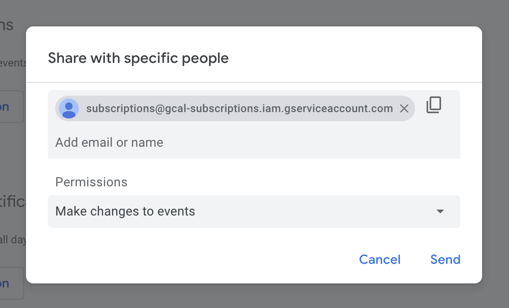

# Google Calendar Subscriptions

[](https://github.com/gabrielecanepa/google-calendar-subscriptions/actions/workflows/sync-subscriptions.yml)

This repository contains functions, types and classes for working with calendar subscriptions using the [Google Calendar API](https://developers.google.com/calendar/api/v3/reference).

It also offers a script and GitHub Actions workflow to customize, create and sync events fetched from calendar subscription URLs.

## Usage

### npm package

Coming soon! 🔜

### Script and GitHub workflow

[Fork this repository](https://github.com/gabrielecanepa/google-calendar-subscriptions/fork) and leave the option `Copy the main branch only` selected.

#### Google credentials

Head over to your Google Cloud console, [create a new project](https://console.cloud.google.com/projectcreate) and [enable the Google Calendar API](https://console.cloud.google.com/apis/library/calendar-json.googleapis.com).

[Create a new service account](https://console.cloud.google.com/iam-admin/serviceaccounts/create) and grant owner permissions to it. Then, select `Manage keys`


and create a new JSON key. A file will be downloaded to your computer.

Open the repository, create an `.env` file and fill the `GOOGLE_CLIENT_EMAIL` and `GOOGLE_PRIVATE_KEY` with values from the downloaded JSON file.

#### Adding subscriptions

Create a new branch named `subscriptions` and checkout to it.

Open `.gitignore` and comment out the line refering to the subscriptions file:

```sh
# src/subscriptions.ts <--- Comment out or delete this line!
```

Create a new file named `src/subscriptions.ts`.

For each subscription, you will need to manually [create a new calendar](https://calendar.google.com/calendar/r/settings/createcalendar) in Google Calendar.

Once created, head over to the calendar settings and add the service email under `Share with specific people or groups`. The service must be able to make changes to events.



Finally, copy ID of the calendar under `Integrate calendar` and open your subscriptions file. The file must export an array of objects with the following structure (defined by the `CalendarSubscription` type):

```ts
{
  // Arbitrary name of the calendar with no spaces.
  name: 'calendar-name',
  // ID of the calendar previously created.
  calendarId: '*************@group.calendar.google.com',
  // URL of the subscription returning an ics file, e.g.:
  subscriptionUrl: 'https://ics.fixtur.es/v2/ac-milan.ics',
  // (Optional) Function to customize the events before they are created.
  fn: (events: CalendarEvent[]) => {
    return events.map(event => {
      // Customize the event following the CalendarEvent definition, e.g.:
      return { ...event, summary: 'Custom summary' }
    })
  },
}
```

An example of subscriptions file is available [here](https://github.com/gabrielecanepa/google-calendar-subscriptions/blob/subscriptions/src/subscriptions.ts).

#### Running the workflow

You can run the script with: 

```sh
yarn start
```

To specify the calendars that will be synced, update the `SUBSCRIPTIONS` variable in your environment file with a comma-separated list of names. The `CLEAR_CALENDARS` variable can be set to `true` to clear the calendars before syncing.

Before pushing your changes and activating the GitHub Actions workflow, you must add the secret variables to your repository. If you are not familiar with the topic, you can follow [this article](https://docs.github.com/en/actions/security-guides/using-secrets-in-github-actions).

You can now commit and push the changes to your repository. A new workflow will be triggered and the events will be created in the calendars. The script is set to run every hour and when the `subscriptions` branch is updated, but you can change this schedule in the `sync-subscriptions.yml` workflow file.

Another workflow, named `keep-alive`, is set to run once a day to prevent the syncing workflow from becoming inactive.

## License

[MIT](../LICENSE)
