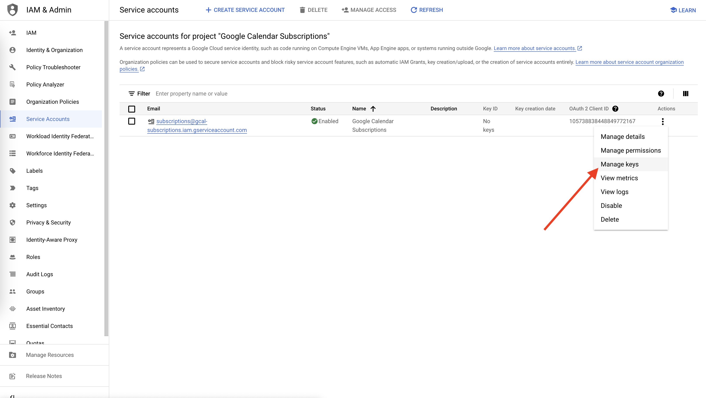

# Google Calendar Subscription

This repository extends the [Google Calendar API client](https://github.com/googleapis/google-api-nodejs-client/tree/main/src/apis/calendar) with types and functions to define, manipulate and sync calendar subscriptions.

## Installation

```sh
yarn add google-calendar-subscriptions
# or
npm i google-calendar-subscriptions
```

## Usage

### Quick start

```ts
import { calendar, GoogleCalendarSubscriptionAsync } from 'google-calendar-subscriptions'

const client = calendar({
  email: '<SERVICE_ACCOUNT_EMAIL>',
  key: '<SERVICE_ACCOUNT_PRIVATE_KEY>',
})

const subscription: GoogleCalendarSubscriptionAsync = {
  name: 'calendar-name', // arbitrary calendar name
  calendarId: '********@group.calendar.google.com', // Google Calendar ID
  subscriptionUrl: 'https://example.com/events.ics', // URL of the iCal feed

  // (Async) function to customize events before they are created
  fn: async events => events.map(event => {
    const { data } = await fetch(`https://api.example.com/${event.id}`)
    return { ...event, summary: data.title }
  })
}

(async () => {
  await client.subscriptions.sync(subscription)
})()
```

### Authentication

Head over to your Google Cloud console, [create a new project](https://console.cloud.google.com/projectcreate) and [enable the Google Calendar API](https://console.cloud.google.com/apis/library/calendar-json.googleapis.com).

[Create a new service account](https://console.cloud.google.com/iam-admin/serviceaccounts/create) and grant owner permissions to it. Then, select `Manage keys`



and create a new JSON key. A file will be downloaded to your computer.

Open the repository, create an `.env` file and fill the `GOOGLE_CLIENT_EMAIL` and `GOOGLE_PRIVATE_KEY` with values from the downloaded JSON file.

### Usage with GitHub Actions

[Fork this repository](https://github.com/gabrielecanepa/google-calendar-subscriptions/fork) and leave the option `Copy the main branch only` selected.

## API

#### `calendar(options?: CalendarOptions): Calendar`

Creates a new instance of the Google Calendar API client.

##### `CalendarOptions`

```ts
{
  // (Optional) Email of the service account.
  email?: string
  // (Optional) Private key of the service account.
  key?: string
  // (Optional) Path to the private key of the service account.
  keyFile?: string
  // (Optional) Scopes to use when authenticating the service account.
  scopes?: string[]
}
```

## Usage with GitHub Actions

[Fork this repository](https://github.com/gabrielecanepa/google-calendar-subscriptions/fork) and leave the option `Copy the main branch only` selected.
